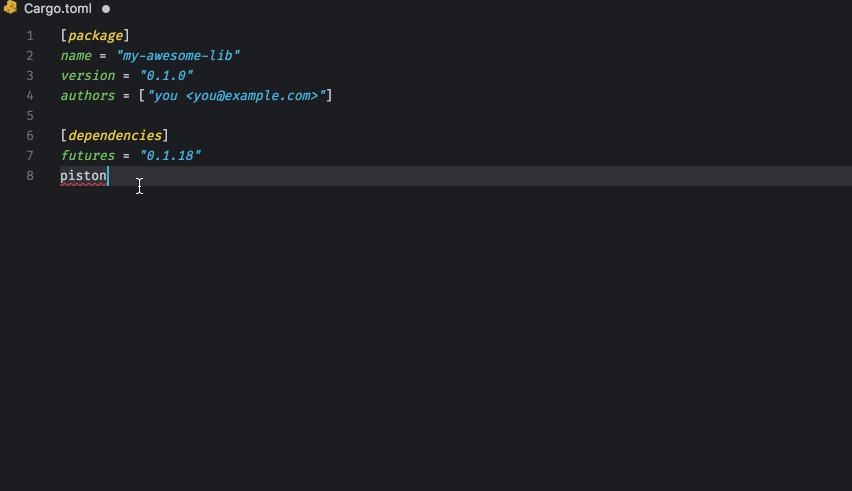

# search-crates-io README

Rust's crates suggestions in your Cargo.toml file (based on crates.io search API);

## Features

This extension provides crates suggestions while editing the Cargo.toml file in your Rust project.
Type in the name of the crate and wait for suggestions to appear, or hit `ctrl+space`.

## TODO
- add tests
- activate the suggestions only in `[dependencies]` section

## Release Notes

### 0.0.1

Basic functionality.
