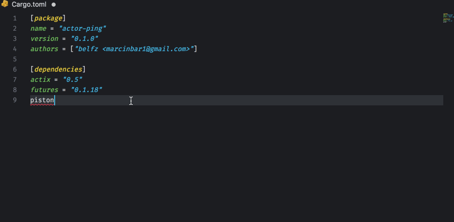

# search-crates-io README

Rust's crates suggestions in your Cargo.toml file (based on crates.io search API);

## Features

This extension provides crates suggestions while editing the Cargo.toml file in your Rust project.
Type in the name of the crate and wait for suggestions to appear, or hit `ctrl+space`.

## Info
This project uses the crates.io's official logo (a verbal consent has been granted by Mozilla representative), but it is NOT officially endorsed by the Rust project.

## TODO
- add tests
- activate the suggestions only in `[dependencies]` section

## Release Notes

### 1.1.1

- Replaces whole line when suggestion is applied, despite of the cursor position in the line.
### 1.0.0

- Adds crates' logo.
- Completes the package.json fields required/suggested by the VSC extensions guidelines.

### 0.0.1

Basic functionality.
